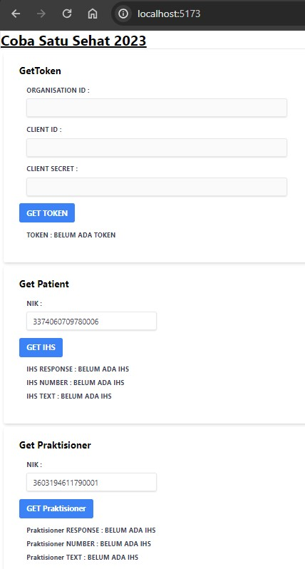
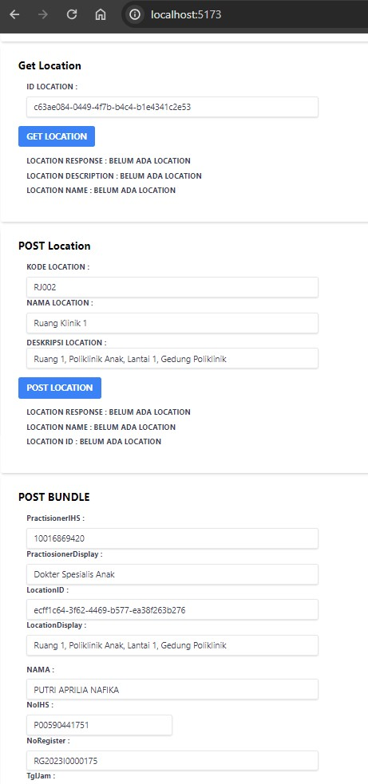
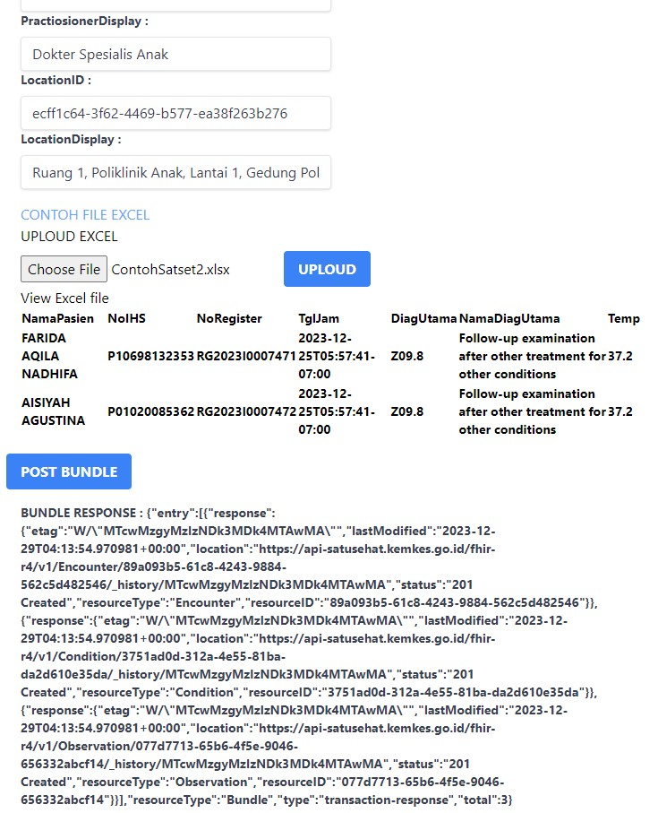

CARA BRIDGING SATU SEHAT

Menjalankan dengan stackblitz
https://stackblitz.com/github/edycoleee/react-satset







referensi :
https://satusehat.kemkes.go.id/platform/docs/id/playbook/

Endpoint Information
OAuth Base URL

https://api-satusehat.kemkes.go.id/oauth2/v1

Base URL

https://api-satusehat.kemkes.go.id/fhir-r4/v1

Consent URL

https://api-satusehat.dto.kemkes.go.id/consent/v1

WAJIB PUNYA

client_id: <client-id>

client_secret: <client-secret>

1.  GET TOKEN

```
        const dataKirim = {
            client_id: clientID,
            client_secret: clientSecret
        }

        axios({
            url: "/api/oauth2/v1/accesstoken?grant_type=client_credentials",
            method: "POST",
            headers: {
                'Content-Type': 'application/x-www-form-urlencoded'
            },
            data: dataKirim,
        })
            .then((res) => {
                console.log("RESPONSE :", res.data);
                console.log("RESPONSE ACCESS TOKEN:", res.data.access_token);
            })
```

2. GET IHS NUMBER

```
        axios({
            url: "/api/fhir-r4/v1/Patient?identifier=https://fhir.kemkes.go.id/id/nik|" + nik,
            method: "GET",
            headers: {
                'Content-Type': 'application/json',
                'Authorization': 'Bearer ' + tokenDt
            },
        })
```

3. GET LOCATION

```
    axios({
      url: "/api/fhir-r4/v1/Location/" + LocationID,
      method: "GET",
      headers: {
        'Content-Type': 'application/json',
        'Authorization': 'Bearer ' + tokenDt
      },
    })
      .then((res) => {
        console.log("RESPONSE :", res.data);
      })
```

4. POST LOCATION

```
  const LocData = {
    phoneNo: "024-76602154",
    urlWeb: "http://rsudsulfat.demakkab.go.id",
    address: "Jl. Raya Semarang Purwodadi KM. 21 No. 107 Karangawen Demak",
    city: "Kab Demak",
    postalCode: "59566",
    kdProvinsi: "33",
    kdKota: "3321",
    kdkecamatan: "332102",
    kdDesa: "3321022001",
    NoRT: "1",
    NoRW: "2",
    longitude: -7.043732645807474,
    latitude: 110.57466438554198,
    altitude: 0,
  }

  const DataLocation = {
    "resourceType": "Location",
    "identifier": [
      {
        "system": "http://sys-ids.kemkes.go.id/location/" + OrganisationID,
        "value": kdLocation
      }
    ],
    "status": "active",
    "name": nameLocation,
    "description": descLocation,
    "mode": "instance",
    "telecom": [
      {
        "system": "phone",
        "value": LocData.phoneNo,
        "use": "work"
      },
      {
        "system": "url",
        "value": LocData.urlWeb,
        "use": "work"
      }
    ],
    "address": {
      "use": "work",
      "line": [
        LocData.address
      ],
      "city": LocData.city,
      "postalCode": LocData.postalCode,
      "country": "ID",
      "extension": [
        {
          "url": "https://fhir.kemkes.go.id/r4/StructureDefinition/administrativeCode",
          "extension": [
            {
              "url": "province",
              "valueCode": LocData.kdProvinsi
            },
            {
              "url": "city",
              "valueCode": LocData.kdKota
            },
            {
              "url": "district",
              "valueCode": LocData.kdkecamatan
            },
            {
              "url": "village",
              "valueCode": LocData.kdDesa
            },
            {
              "url": "rt",
              "valueCode": LocData.NoRT
            },
            {
              "url": "rw",
              "valueCode": LocData.NoRW
            }
          ]
        }
      ]
    },
    "physicalType": {
      "coding": [
        {
          "system": "http://terminology.hl7.org/CodeSystem/location-physical-type",
          "code": "ro",
          "display": "Room"
        }
      ]
    },
    "position": {
      "longitude": LocData.longitude,
      "latitude": LocData.latitude,
      "altitude": LocData.altitude
    },
    "managingOrganization": {
      "reference": "Organization/" + OrganisationID
    }
  }

    axios({
      url: "/api/fhir-r4/v1/Location",
      method: "POST",
      headers: {
        'Content-Type': 'application/json',
        'Authorization': 'Bearer ' + tokenDt
      },
      data: DataLocation,
    })
      .then((res) => {
        console.log("RESPONSE :", res.data);
        setResLocation(res.data)
        setLoading(false)
      })
```

5. GET PRACTIOSIONER

```
        axios({
            url: "/api/fhir-r4/v1/Practitioner?identifier=https://fhir.kemkes.go.id/id/nik|" + nik,
            method: "GET",
            headers: {
                'Content-Type': 'application/json',
                'Authorization': 'Bearer ' + tokenDt
            },
        })
            .then((res) => {
                console.log("RESPONSE :", res.data);
                setNumberIHS(res.data)
                setLoading(false)
            })
```

6. POST BUNDLE ENCOUNTER CONDITION OBSERVATION

```
  const [dtSend, setDtSend] = useState({
    NamaPasien: "PUTRI APRILIA NAFIKA",
    NoIHS: "P00590441751",
    NoRegister: "RG2023I0000175",
    TglJam: "2023-12-27T05:57:41-07:00",
    DiagUtama: "K35.8",
    NamaDiagUtama: "Acute appendicitis, other and unspecified",
    Temp: 36,
    PractisionerIHS: "10016869420",
    PractiosionerDisplay: "Dokter Spesialis Anak",
    LocationID: "ecff1c64-3f62-4469-b577-ea38f263b276",
    LocationDisplay: "Ruang 1, Poliklinik Anak, Lantai 1, Gedung Poliklinik",
  })

  const handleChange = (e) => {
    setDtSend((prev) => ({
      ...prev,
      [e.target.name]: e.target.value
    }))
  }
  const uuidEncounter = uuidv4()
  const uuidCondition = uuidv4()
  const uuidObservation = uuidv4()

  const DATABUNDLE = {
    "resourceType": "Bundle",
    "type": "transaction",
    "entry": [
      {
        "fullUrl": "urn:uuid:" + uuidEncounter,
        "resource": {
          "resourceType": "Encounter",
          "status": "finished",
          "class": {
            "system": "http://terminology.hl7.org/CodeSystem/v3-ActCode",
            "code": "AMB",
            "display": "ambulatory"
          },
          "subject": {
            "reference": "Patient/" + dtSend.NoIHS,
            "display": dtSend.NamaPasien
          },
          "participant": [
            {
              "type": [
                {
                  "coding": [
                    {
                      "system": "http://terminology.hl7.org/CodeSystem/v3-ParticipationType",
                      "code": "ATND",
                      "display": "attender"
                    }
                  ]
                }
              ],
              "individual": {
                "reference": "Practitioner/" + dtSend.PractisionerIHS,
                "display": dtSend.PractiosionerDisplay
              }
            }
          ],
          "period": {
            "start": dtSend.TglJam,
            "end": dtSend.TglJam
          },
          "location": [
            {
              "location": {
                "reference": "Location/" + dtSend.LocationID,
                "display": dtSend.LocationDisplay
              }
            }
          ],

          "statusHistory": [
            {
              "status": "arrived",
              "period": {
                "start": dtSend.TglJam,
                "end": dtSend.TglJam
              }
            },
            {
              "status": "in-progress",
              "period": {
                "start": dtSend.TglJam,
                "end": dtSend.TglJam
              }
            },
            {
              "status": "finished",
              "period": {
                "start": dtSend.TglJam,
                "end": dtSend.TglJam
              }
            }
          ],
          "serviceProvider": {
            "reference": "Organization/" + OrganisationID
          },
          "identifier": [
            {
              "system": "http://sys-ids.kemkes.go.id/encounter/" + OrganisationID,
              "value": dtSend.NoRegister
            }
          ]
        },
        "request": {
          "method": "POST",
          "url": "Encounter"
        }
      },
      {
        "fullUrl": "urn:uuid:" + uuidCondition,
        "resource": {
          "resourceType": "Condition",
          "clinicalStatus": {
            "coding": [
              {
                "system": "http://terminology.hl7.org/CodeSystem/condition-clinical",
                "code": "active",
                "display": "Active"
              }
            ]
          },
          "category": [
            {
              "coding": [
                {
                  "system": "http://terminology.hl7.org/CodeSystem/condition-category",
                  "code": "encounter-diagnosis",
                  "display": "Encounter Diagnosis"
                }
              ]
            }
          ],
          "code": {
            "coding": [
              {
                "system": "http://hl7.org/fhir/sid/icd-10",
                "code": dtSend.DiagUtama,
                "display": dtSend.NamaDiagUtama
              }
            ]
          },
          "subject": {
            "reference": "Patient/" + dtSend.NoIHS,
            "display": dtSend.NamaPasien
          },
          "encounter": {
            "reference": "urn:uuid:" + uuidEncounter,
            "display": "Kunjungan " + dtSend.NamaPasien + " di " + dtSend.TglJam
          }
        },
        "request": {
          "method": "POST",
          "url": "Condition"
        }
      },
      {
        "fullUrl": "urn:uuid:" + uuidObservation,
        "resource": {
          "resourceType": "Observation",
          "status": "final",
          "category": [
            {
              "coding": [
                {
                  "system": "http://terminology.hl7.org/CodeSystem/observation-category",
                  "code": "vital-signs",
                  "display": "Vital Signs"
                }
              ]
            }
          ],
          "code": {
            "coding": [
              {
                "system": "http://loinc.org",
                "code": "8310-5",
                "display": "Body temperature"
              }
            ]
          },
          "subject": {
            "reference": "Patient/" + dtSend.NoIHS
          },
          "performer": [
            {
              "reference": "Practitioner/" + dtSend.PractisionerIHS,
            }
          ],
          "encounter": {
            "reference": "urn:uuid:" + uuidEncounter,
            "display": "Kunjungan " + dtSend.NamaPasien + " di " + dtSend.TglJam
          },
          "effectiveDateTime": dtSend.TglJam,
          "valueQuantity": {
            "value": dtSend.Temp,
            "unit": "C",
            "system": "http://unitsofmeasure.org",
            "code": "Cel"
          },
        },
        "request": {
          "method": "POST",
          "url": "Observation"
        }
      }
    ]
  }

  const postBundle = () => {
    setLoading(true)
    console.log("POST Bundle", DATABUNDLE);

    axios({
      url: "/api/fhir-r4/v1",
      method: "POST",
      maxBodyLength: Infinity,
      headers: {
        'Content-Type': 'application/json',
        'Authorization': 'Bearer ' + tokenDt
      },
      data: DATABUNDLE,
    })
      .then((res) => {
        console.log("RESPONSE :", res.data);
        setResBundle(res.data)
        setLoading(false)
      })
      .catch((err) => {
        console.log("ERROR :", err);
        setLoading(false)
      });
  }
```

7. POST BUNDLE FROM EXCEL

```

```
